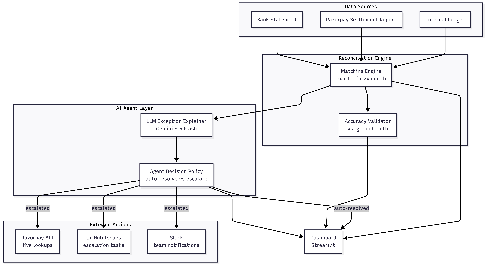
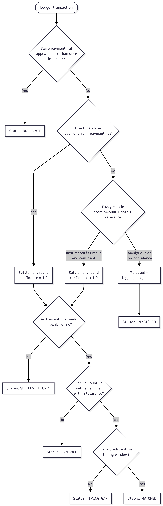

# ReconAgent

ReconAgent is an AI-assisted finance reconciliation dashboard and workflow agent for identifying payment mismatches, classifying exceptions, and guiding operational follow-up across ledger, settlement, and bank data.

It is designed for a finance operations use case where a merchant or operations team needs to answer questions like:

- Did the payment settle correctly?
- Is there a mismatch between ledger and bank credit?
- Was the customer payment captured but the funds delayed?
- Which exceptions need investigation, escalation, or manual review?

The project combines deterministic reconciliation logic, business rule classification, and an agent-like workflow to turn raw data into auditable actions.

---

## Overview

ReconAgent ingests three data sources:

1. Internal ledger
2. Razorpay settlement records
3. Bank statement / bank credit data

It matches payments across these sources and flags issues such as:

- Matched records
- Duplicate ledger entries
- Settlement gaps
- Bank delays
- Amount variance
- Unmatched transactions

These are then surfaced in a Streamlit dashboard with workflow actions such as:

- Investigate exception
- Add exception note
- Retry reconciliation
- Create finance task
- Escalate to finance ops
- Mark as reviewed
- Mark as resolved

---

## Why this project exists

Traditional reconciliation is often noisy and manual. Finance teams deal with:

- inconsistent data formats
- delayed bank credits
- partial or missing settlement data
- duplicate entries
- human follow-up across multiple teams

ReconAgent helps by making the process more transparent and operationally actionable.

It does not blindly rewrite financial data. Instead, it keeps the source records as the system of truth and records workflow decisions separately in an audit-friendly action log.

---

## Project workflow

The project follows a practical agentic workflow:

### 1. Data ingestion

The system reads source CSV files from the data folder or from uploaded files in the dashboard.

Typical file inputs:

- ledger data
- settlement data
- bank statement data

The uploaded CSV validation step ensures required columns are available before reconciliation runs.

### 2. Reconciliation engine

The core logic lives in the reconciliation engine. It compares:

- ledger payment reference with settlement payment id
- settlement UTR / settlement reference with bank reference data

This produces a structured result for each ledger record, including match status, variance, dates, and notes.

### 3. Exception classification

Each reconciliation result is classified into a meaningful exception type, such as:

- MATCHED
- DUPLICATE
- TIMING_GAP
- VARIANCE
- UNMATCHED
- SETTLEMENT_ONLY

The system attaches a recommended action, owner, SLA, and justification.

### 4. Agentic workflow layer

A finance workflow agent decides what to do next based on the exception evidence. It can:

- review a case
- create a task
- escalate a case
- add notes
- retry a reconciliation job
- mark a case resolved

The decision is guided by an action policy and logged into workflow memory.

### 5. External tool integration

The agent can call external systems in demo mode or live mode, including:

- Razorpay payment / settlement lookup
- GitHub issue creation
- Slack notification sending

These calls are designed to support operational workflows, not to mutate financial source records.

### 6. Dashboard

The Streamlit app brings the entire process together in one interface.

From the dashboard, users can:

- upload CSV files
- validate schemas
- run reconciliation
- inspect exception cards
- open workflow actions
- trigger escalation or investigation flows
- review results and logs

---

## Architecture

The codebase is organized around a few core pieces:

- app.py — Streamlit dashboard UI
- recon_engine.py — reconciliation logic and exception classification
- agent_actions.py — workflow policy, action plan, memory, and action logging
- agent_controller.py — agent orchestration and external tool calls
- external_tools.py — Slack, GitHub, and Razorpay wrappers
- recon_agent_generator.py — synthetic data generation
- run_recon.py — full pipeline runner
- accuracy_check.py — evaluation / validation helpers
- llm_explainer.py — optional natural-language exception explanations

### System architecture

<p align="center">
	
</p>

### Reconciliation engine

<p align="center">
	
</p>

---

## Typical operating flow

A normal execution looks like this:

1. Generate or upload data
2. Validate the CSV schema
3. Run the reconciliation engine
4. Review exception outputs
5. Choose workflow actions from the dashboard
6. The agent logs activity and optionally calls external tools
7. Operators review escalations or tasks and close the issue

This creates a transparent sequence: Observe → Investigate → Decide → Act → Verify.

---

## Dashboard features

The dashboard includes:

- KPI cards for matched, unmatched, variance, and timing-gap cases
- Visual charts for reconciliation outcomes
- Exception detail cards with confidence and classification data
- Workflow buttons for investigation and escalation
- Upload support for ledger, settlement, and bank files
- Timestamped saved uploads for repeatable review

---

## Project setup

### Prerequisites

- Python 3.11+
- pip
- Access to the project folder

### Install dependencies

```bash
pip install -r requirements.txt
```

### Environment variables

If you want live integrations, configure the following environment values in a .env file or your shell environment:

```bash
GEMINI_API_KEY=
RAZORPAY_KEY_ID=
RAZORPAY_SECRET_KEY=
SLACK_WEBHOOK_URL=
GITHUB_TOKEN=
```

Note: the project is designed to degrade gracefully when many of these are not configured. The core reconciliation pipeline can still run without external API access.

---

## Run the project

### Generate demo data

```bash
python recon_agent_generator.py
```

### Run the reconciliation pipeline

```bash
python run_recon.py
```

### Start the dashboard

```bash
streamlit run app.py
```
---

## Data and output files

The project writes outputs into the data directory:

- internal_ledger.csv
- razorpay_settlement.csv
- bank_statement.csv
- recon_results.json
- recon_summary_table.csv
- exception_classifications.json
- exception_classifications.csv
- llm_exception_explanations.json
- workflow_actions.json
- agent_action_log.json
- agent_memory.db

These outputs are useful for demo review, audit trails, and validation.

---

## Example exception flow

A common finance exception looks like this:

- Payment is captured successfully
- Settlement is delayed or missing
- Bank credit is not yet visible
- The system marks the payment as TIMING_GAP or MISSING_BANK
- The workflow agent escalates the issue to finance ops
- Slack and GitHub actions are triggered for follow-up

This is the kind of realistic operational scenario the project is built to model.

---

## Safety and design choices

The project intentionally keeps source financial records immutable while storing action metadata separately. This makes it safer for demos, internal prototypes, and operational workflow experiments.

Key safety principles:

- no direct mutation of source CSVs during agent actions
- decision logs are captured separately from raw data
- workflow steps are auditable
- external tools are used for investigation and escalation, not for changing financial truth

---

## Use cases

This project is suitable for:

- payment reconciliation demos
- finance operations workflow prototypes
- exception triage dashboards
- AI-assisted cash ops monitoring
- internal fintech tooling experiments

---

## Notes

This repository is best viewed as a finance workflow MVP and demo project rather than a production-grade banking system. It focuses on a realistic workflow, clear decision logic, and explainable operational actions.

---

## License

This project is intended for educational, internal demo, and prototype use unless another license is specified in the repository.

---

## Summary

ReconAgent brings together three important capabilities:

- reconciliation of multi-source financial data
- exception detection and classification
- agentic workflow execution for investigation and escalation

Together, they offer a practical demo of how AI can support finance operations without replacing the system of record.
